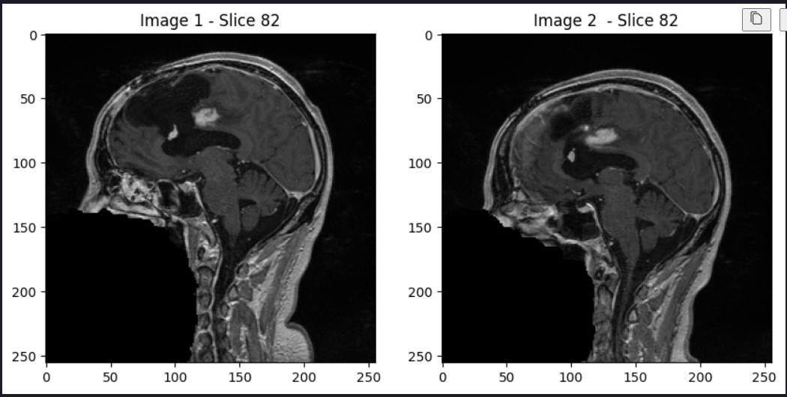
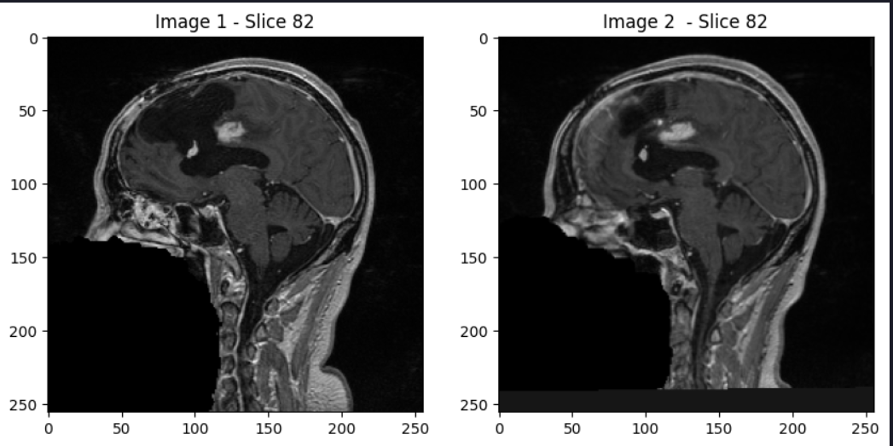
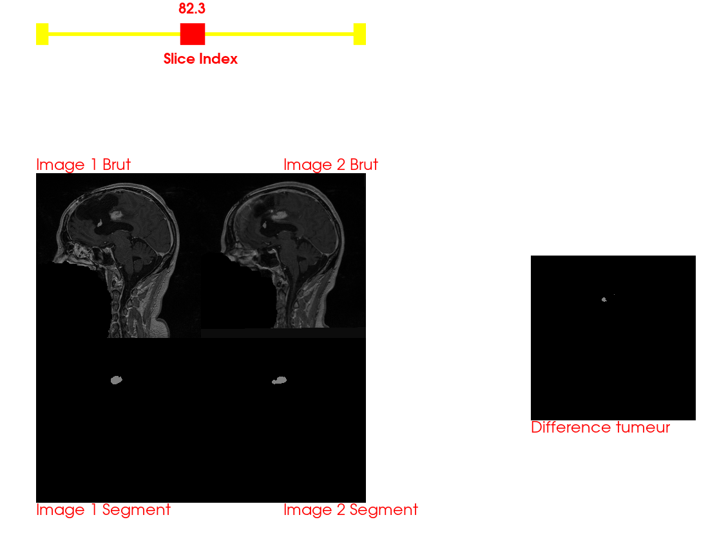

# Project Documentation ITK/VTK (Etude longitudinale de l’évolution d’une tumeur)

## Auteurs

- Andrii Hrona (andrii.hrona@epita.fr)
- Antoine Menard (antoine.menard@epita.fr)
- Damien Tissot (damien.tissot@epita.fr)

## Instructions

Il est nécessaire d'installer les bibliothèques utilisés (surtout pour tqdm qui sert à afficher la barre de progression)

```py
pip install -r requirements.txt
```

## Recalage (ITK)

*Fait par Andrii HRONA*

#### Choix techniques: 

- Image fixed: **case6_gre1.nrrd**
- Image moving: **case6_gre2.nrrd**

En affichant les 2 slices de 2 scans côte à côte, j'ai remarqué que la deuxième image n'était pas bien alignée, mais avec une rotation un peu près correcte. Aussi j'ai l'impression, qu'il y a un décalage en profondeur, par consequent les tranches ne corresponds pas vraiment.



Ainsi pour aligner plus précisement les images, j'ai decidé de faire un recalage rigide.

Transformation:
- Rigid2DTransform (elle est adapté pour les translations et les rotations, ce que nous avons besoin)

Métrique (Plusieurs ont été testés):
- MeanSquaresImageToImageMetricv4: (les 2 images ont la même intensité)
    -  Cela a donné des resultats plutôt corrects, cependant certaines tranches présentait des rotations importantes
- Cross-Corrélation 
    - Idem que pour Mean Square
- Coefficient de corrélation
- **Information Mutuelle**
    - Cela a donnée des meilleurs résultats, les rotations dans certaines trances ont disparus

L'optimiseur:
- Descente de gradient 

Interpolateur:
- Linéaire (par défaut)

#### Limites:
- Les images sont recalées tranche par tranche, ils sont bien alignées, cependant il manque un recalage en profondeur, peut être faisant des tranformations 3D, ce que je n'ai pas réussi à faire fonctionner.



## Segmentation (ITK)

*Fait par Damien TISSOT*

#### Partie segmentation :

L'utilisation du filtre Connected Threshold avec ITK permet :
   - Segmentation Basée sur les Intensités : Segmente des régions basées sur des valeurs d'intensité spécifiques.
   - Seed Initiale : Permet de contrôler précisément la région à segmenter.
   - Contrôle des limites : Définir exactement les plages d'intensité à inclure dans la segmentation.

#### Difficultés rencontrées:

- Détermination des valeurs de seuils : Il a fallu trouver les bons seuils pour n'avoir que la tumeur. 
- Détermination de la zone à segmenter correspondant à la zone de la tumeur : Trouver la zone de la tumeur a nécessité des tests pour déterminer avec précision la zone de la tumeur.

## Visualisation (VTK)

*Fait par Antoine MENARD*

#### Partie affichage :

- Composé de 4 images positionnées en carré au centre de l'écran
    
    - À droite, l'image 'case6gre1.nrrd'
    - À gauche, l'image 'case6gre2.nrrd'

    - les deux supérieurs représentent la slide de données brutes
    - les deux inférieurs représentent le résultat de la segmentation

- L'image tout à droite affiche la différence de volume de la tumeur entre l'image 1 et 2

- Pour choisir la diapositive à segmenter, il suffit de faire glisser la barre 'slide Index' se trouvant en haut de l'écran

#### Difficultés rencontrées:

- Afin de faciliter le travail avec VTK, je récupère les images sous forme d'array. Cependant elles sont inversées et demandent un traitement supplémentaire simplifiés par numpy
- Positionnement des images se fait avec les coordonnées des pixels, il faut donc calculer la position de l'image selon la taille de l'écran disponible
- Dans l'ensemble, l'utilisation de VTK est très verbeuse, et beaucoup de paramètres doivent être setup ou alors hardcode


### Résultats obtenus



Nous determinons la zone de la tumeur pour chaque scan, et la différence entre 2 images prises à des différentes dates. La tumeur est segmenté, cependant il se peut que sa taille soit legèrement differente à cause des seuils choisis. La différence entre 2 dates peut être aussi faussé à cause du récalage qui ne se fait pas en profondeur.